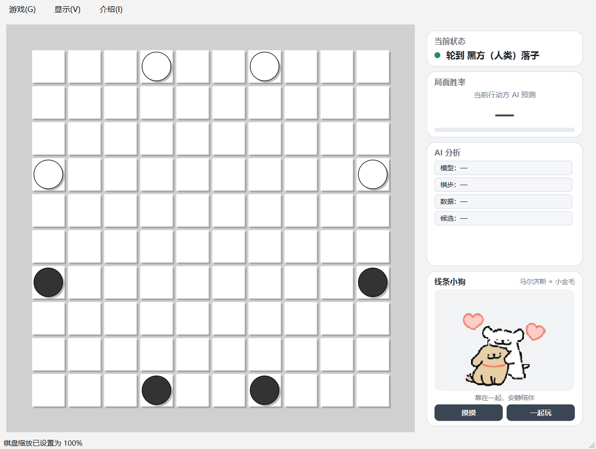

<div align="center">

# 亚马逊棋 · Game of the Amazons

一款带有双神经网络引擎、三阶段胜率分析与桌面宠物的 PyQt6 亚马逊棋客户端。

[](https://github.com/xuzhifanGithub/amazonGame/actions/workflows/test.yml)


</div>



## 项目亮点

- **三种 AI 路线**：C++ MCTS、`amazon_X` 新模型和 `amazon_L` 原始模型。
- **完整回合分析**：分别展示“选子 → 移动 → 射箭”的胜率、访问量和 Top-N 候选。
- **稳定的 AI 生命周期**：请求版本隔离、后台提示、引擎池复用，以及新游戏/悔棋时的旧结果丢弃。
- **可缩放主题界面**：四套棋盘主题、80%—140% 缩放和主题自适应右侧卡片。
- **便携资源布局**：模型、引擎、配置和依赖 DLL 均位于项目内部，不读取机器上的外部模型。
- **轻量桌面宠物**：右侧线条小狗拥有随机动作和简单互动，不影响棋局逻辑。

## 快速开始

项目自带环境脚本。由于模型和原生引擎通过 Git LFS 管理，首次克隆前请先安装
[Git LFS](https://git-lfs.com/) 并执行 `git lfs install`。完整功能版本目前正式支持
**Windows x64 + Python 3.11 / 3.13**：

Windows：

```bat
setup_env.bat   :: 创建 .venv 并安装依赖（首次）
run.bat         :: 启动游戏
```

### 自包含便携版

发布时可生成 `dist/Amazons/` 便携目录。该目录内包含 Python 运行时、PyQt6、NumPy、
MCTS 模块、KataGo 引擎、所需 DLL、`amazon_X` 模型和 `amazon_L` 模型；目标电脑不需要另行安装
Python，也不需要在项目目录之外配置模型或引擎文件。

```bat
setup_env.bat
.venv\Scripts\python.exe -m pip install -r requirements-dev.txt
build_portable.bat
```

构建完成后直接复制整个 `dist\Amazons` 文件夹并运行其中的 `Amazons.exe`。不要只复制
单独的 exe，因为配套模型和引擎保存在同一便携目录内。GPU KataGo 仍需要目标 Windows
系统安装可用的显卡/OpenCL 驱动；这是硬件驱动，不能由应用安全替代。没有可用驱动时，
人类对局和项目内置的 MCTS 仍可使用。

Linux / macOS 可运行纯 Python GUI 和人人对弈；MCTS 与 kataAmazon 需要在目标平台
自行编译对应原生模块和引擎：

```bash
./setup_env.sh
./run.sh
```

需要本机已安装 Python 3.11—3.13（推荐 3.11 或 3.13，与预编译的 C++ MCTS 模块匹配）。
缺少某个原生模块、模型或配置时，对应 AI 菜单会自动禁用，程序仍可进行人人对弈。

## AI 引擎说明

- **`amazon_X`（新模型，默认）**：
  - `src/ai/kataAmazonEngineCuda/amazons.exe`（**OpenCL/GPU**）。搭配
    模型文件 `amazon10x10_xzf.bin.gz`。需要支持 OpenCL 的显卡及正确安装的驱动；
    随目录附带 `OpenCL.dll` / `libz.dll` / `libzip.dll` / `zlib.dll` / `zip.dll` /
    MSVC 运行库与 `engine.cfg`。首次运行会做一次 OpenCL 自动调优，结果缓存在
    目录内的 `KataGoData/opencltuning/`。
- **`amazon_L`（原始模型，后备）**：
  - `src/ai/kataAmazonEngine/kataAmazon.exe`（原始 **OpenCL/GPU** 引擎），搭配
    `weights/amazons10x10.bin.gz`。
- **默认自动选择**：`amazons_engine.py` 检测到 `amazon_X` 的完整资源则优先使用，
  否则回退到 `amazon_L`；GUI 菜单可为黑白双方独立选择。
- **模型**：`src/ai/kataAmazonEngineCuda/amazon10x10_xzf.bin.gz`
  （架构 `b20c256legacyv10`，20 残差块 / 256 通道；
  SHA-256 `bd2c04f20ce7c597269c62ac2d1ddf6c6acdafc5a5d8d913998f37efd681fac6`）。
  `amazon_X` 的默认对局搜索配置使用 600 visits。
- **通信**：以 GTP 子进程运行，用有超时边界的 `kata-genmove_analyze` 获取着法和胜率。
  对局着法只在规则层验证通过后提交到所有引擎；提示使用独立后台线程和当前历史快照，
  不会阻塞界面或继续分析旧棋盘。
- **可移植**：`src/ai/amazons_engine.py` 中所有运行资源都相对该文件计算，正常运行固定使用
  项目或便携目录内随附的引擎、模型与配置，不读取机器上的外部模型路径。

> 注意：`amazon_X` 模型采用与配套引擎兼容的格式，**只能被配套的 `amazons.exe` 加载**。
> CUDA 版 `katago.exe` 会报 `unknown activation type`，原始 `kataAmazon.exe` 同样无法加载。
> 目录名 `kataAmazonEngineCuda` 是历史遗留，当前其中放的是 OpenCL 版引擎。
> 项目只保留界面中实际可选的 `amazon_X` 与 `amazon_L` 后端，不携带未接入运行流程的
> 试验引擎和重复权重。

## 功能

1. **双模型对弈**：菜单「游戏 → 黑方/白方 → AI → amazon_X / amazon_L」即可独立配置双方。
2. **显示胜率**（仿照参考 Hex 项目）：
   - 右侧信息面板实时显示当前行动方的 AI 胜率百分比；
   - 状态栏显示胜率 / 搜索次数 / 局面估值。
3. **AI 提示**：菜单「显示 → 显示完整回合胜率」(Ctrl+H)，沿最佳着法显示
   `S（选子）→ M（移动）→ A（射箭）` 三个阶段的胜率；三个数值统一为原行动方视角。
   交互提示使用独立的低延迟配置（150/120 visits），正式对局仍使用 600/400 visits。

## 开发与测试

```bash
python -m pip install -r requirements-dev.txt
python -m pytest -q
```

也可以运行与 CI 一致的完整检查：

```bash
python -m compileall -q main.py src tests
python -m pytest -q
python scripts/check_release.py
git diff --check
```

测试覆盖规则执行与悔棋、GTP 分析解析、三阶段视角换算、分析后棋盘恢复、
合法提交广播、过期提示丢弃以及 AI 失败回退。CMake 的临时 `build/` 目录不纳入仓库，
发布用预编译模块放在 `src/ai/native/`。

## 目录结构

```
main.py                         入口
requirements.txt                依赖
setup_env.(bat|sh) / run.(bat|sh)  自带环境脚本
src/
  core/simulator.py             亚马逊棋规则
  ai/
    amazons_engine.py           KataGo 引擎桥接（GTP + 胜率）
    amazon_ai_agent.py          AI 线程调度 + 异步提示查询
    results.py                  跨线程的类型化 AI/提示结果
    native/                     发布用预编译 MCTS 模块（不含 CMake 临时文件）
    kataAmazonEngineCuda/       amazon_X + amazons.exe(OpenCL) + amazon10x10_xzf.bin.gz + dll + 配置（默认）
    kataAmazonEngine/           原始引擎 kataAmazon.exe(OpenCL) + weights/ + engine.cfg（后备）
  gui/
    amazon_board_widget.py      棋盘绘制（含提示圆环）
    amazon_main_window.py       主窗口（菜单 / 胜率显示 / 提示）
```

## 参与项目

提交问题前请先阅读 [贡献指南](CONTRIBUTING.md)。安全问题请按照
[安全策略](SECURITY.md) 私下报告；问题模板会引导你附上必要的系统和日志信息。

## 使用范围与模型政策

项目模型允许用于推理、研究、评测、教学，以及合法合规的微调和继续训练。严禁在赛事、
天梯、平台对局或其他竞争场景中违反规则使用本模型或其衍生模型，包括未按要求披露 AI、
代打、作弊、操纵排名或奖金。赛事规则明确允许的 AI 组别、研究赛和引擎赛不受此限制。

完整条款见 [模型使用政策](MODEL_USAGE.md)。本仓库当前未授予通用开源许可证，默认版权
保护适用；第三方引擎、运行库、字体和素材仍分别受其原始许可证及权利声明约束。
